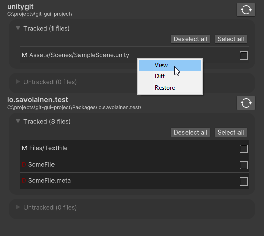
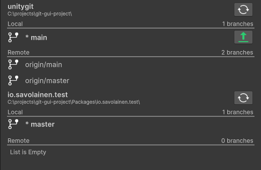

# UnityGit

### Note: UnityGit is experimental and a work-in-progress.
#### There is no official release yet, and the project is subject to change drastically.

UnityGit, at the time of writing, offers
- a window for creating commits, where the user can also view, diff and restore files
- a branch window for viewing branches, pulling and pushing.

UnityGit recognizes the Git repository inside the project's root folder and any repository
inside Packages.

UnityGit is powered by

- [LibGit2Sharp](https://github.com/libgit2/libgit2sharp)
- [libgit2](http://libgit2.github.com/)
- [UIComponents](https://github.com/jonisavo/uicomponents).

Icons

<a target="_blank" href="https://icons8.com/icon/120699/merge-git">Merge Git</a> icon by <a target="_blank" href="https://icons8.com">Icons8</a>

<a target="_blank" href="https://icons8.com/icon/g5xE4eaXvJuI/git-branch">Git branch</a> icon by <a target="_blank" href="https://icons8.com">Icons8</a>

<a target="_blank" href="https://icons8.com/icon/59872/refresh">Refresh</a> icon by <a target="_blank" href="https://icons8.com">Icons8</a>

<a target="_blank" href="https://icons8.com/icon/83225/upload">Upload</a> icon by <a target="_blank" href="https://icons8.com">Icons8</a>

<a target="_blank" href="https://icons8.com/icon/83159/download">Download</a> icon by <a target="_blank" href="https://icons8.com">Icons8</a>
